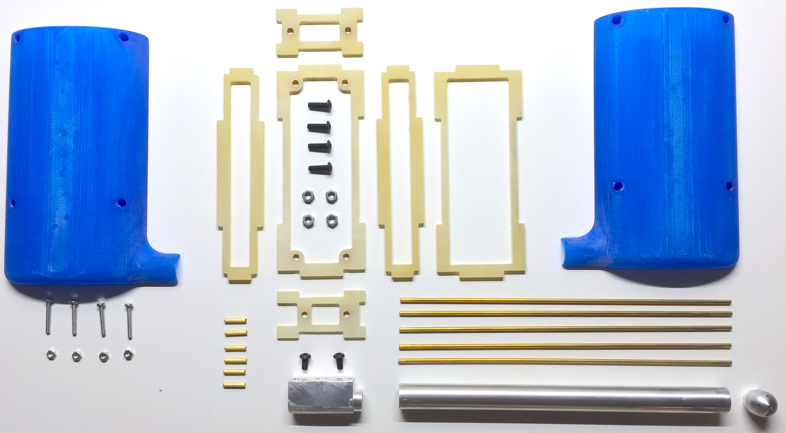

# Air Data Sensor Unit

This directory contains all plans to build the mechanical and electronical assembly of the Air Data Sensor Unit, as well as supporting files for obtaining calibrated measurements.

- [CAM](CAM) contains the g-code files for milling the two aluminum pieces (base and tip), the glassfibre mount, and the PCB, as well as STL files for the housing (3D-printed with PLA)
- [CFD](CFD) contains the pressure coefficient at the probe's tip computed with *ANSYS*, as well as the calibration curve for the static pressure port
- [Matlab](Matlab) contains three scripts for calculating the realtions between differential pressures and the flow parameters (airspeed, alpha, beta), as well as a set of precomputed characteristics:
  - *alpha_beta_algorithm.m* Computes alpha, beta and airspeed from the three measured differential pressures iteratively
  - *characterisitic.m* Computes and plots characteristic curves of alpha and beta for fixed total pressures
  - *lookup_table.m* Computes a lookup table to be used in real time from the flight computer (result of script is found in [AirDataComputer_data.cpp](/Flight_Computer/Main/sensors/AirDataComputer_data.cpp))
- [PCB](PCB) contains the KiCad project of the sensor circuit, along with the gerber files of the PCB

