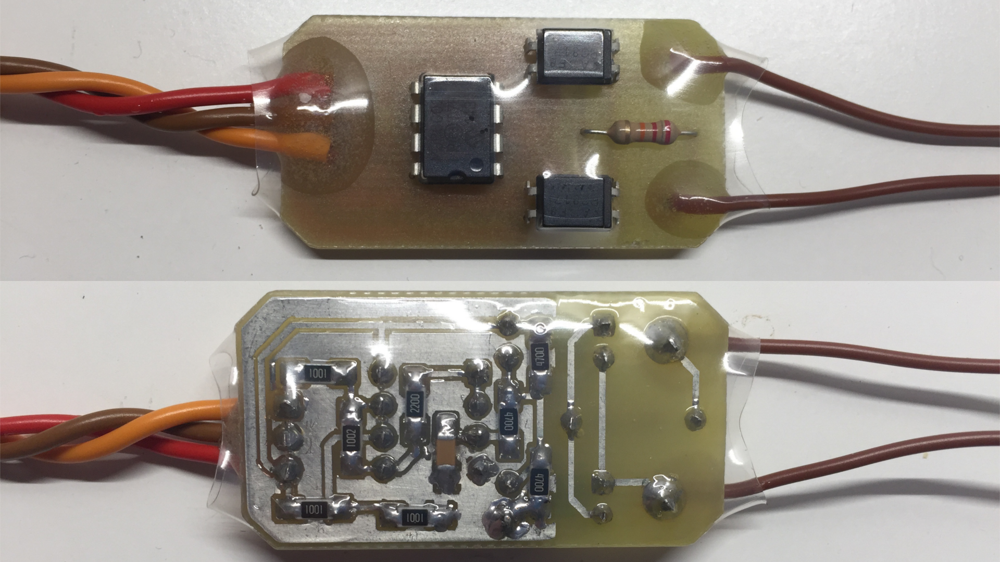

# Electronics

This directory contains all custom developed circuits used in the ARM-Hawk project.

### Brushless RPM sensor

This sensor is connected to two of the three BLDC motor's phases. It outputs a square wave with a frequency equal to that of the electric field's frequency.

- [Brushless_RPM_sensor/CAM](Brushless_RPM_sensor/CAM) contains g-code files for milling the PCB
- [Brushless_RPM_sensor/KiCad](Brushless_RPM_sensor/KiCad) contains the KiCAD project, as well as the PCB's gerber files

### Servoswitch

The servoswitch multiplexes the servo PWM signals coming either form the flight computer or the RC receiver. A PWM channel from the RC receiver can switch all four channel outputs between these two input sources. An ATtiny13 microcontroller executes the task of switching. Many failsafe features are included in the design.

- [Servoswitch/Code](Servoswitch/Code) contains the C program for the microcontroller
- [Servoswitch/KiCad](Servoswitch/KiCad) contains the KiCAD project (only schematic)

