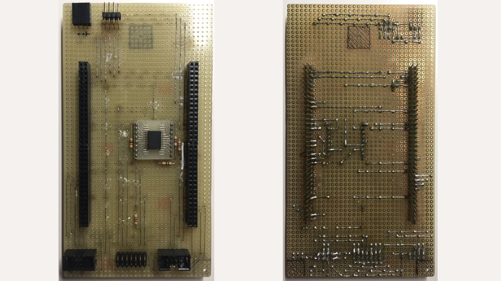

# Flight Computer

This directory contains the flight computer's C++ software. The project has been created with *System Workbench for STM32 by AC6* ([http://www.openstm32.org](http://www.openstm32.org)).

The used hardware is an STM32F767ZI on a Nucleo development board (from ST), powered from a simple power supply providing 5V and 3.3V. Additionally, a *Sparkfun Venus638 GPS breakout* is used. All this is located in the rear equipment bay of the plane:

The Nucleo board is connected to all sensors and the datalog via a prototype interface PCB:

The forward (underwing) equpiment area holds the RC equipment, as well as the [Servoswitch](/Electronics/Servoswitch) and the [IMU](/IMU):

