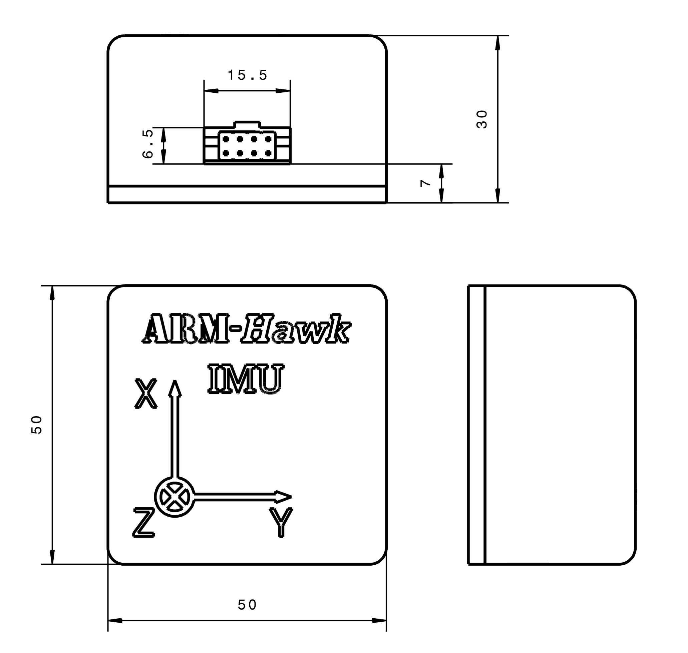

# IMU

This directory contains all plans to build and calibrate the ARM-Hawk custom designed IMU. It consits of an *NXP FXAS21002* gyroscope and an *NXP FXOS8700* accelerometer/magnetometer. A CNC-machined baseplate provides an exact reference for calibration and mounting in the plane. A 3D-printed case protects the sensor ICs form high-current cables (magnetic fields).

- [Calibration_accelerometer](Calibration_accelerometer) contains a Matlab script to calibrate the accelerometer (a sample dataset and result is also included)
- [Calibration_gyro](Calibration_gyro) contains a Matlab script to calibrate the gyroscope (a sample dataset and result is also included)
- [Calibration_magnetometer](Calibration_magnetometer) contains two Matlab scripts to calibrate the magnetometer for the static case and the dynamic case with the motor running (a sample dataset and result is also included)
- [CAM](CAM) contains the g-code files needed for milling the baseplate (floor), the spacer and the interface PCB, as well as an STL file for 3D-printing the case
- [Jig](Jig) contains a g-code file to mill an alignment jig needed for calibration from an 1.5mm glassfibre plate
- [PCB](PCB) contains the KiCad project of the interface circuit and the PCB's gerber files
- [Simulation](Simulation) contains a *Simulink* model of the state estimation algorithm, which is performed from the flight computer in real time (a sample dataset recorded during a test flight is included)

CAD drawing with dimensions and rendering of the case:

